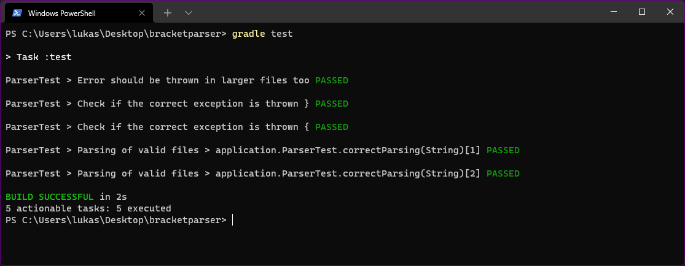
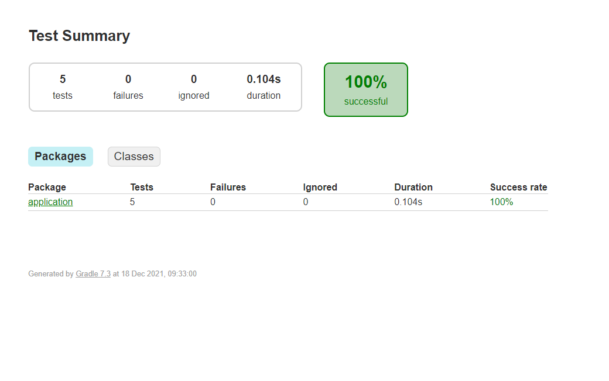
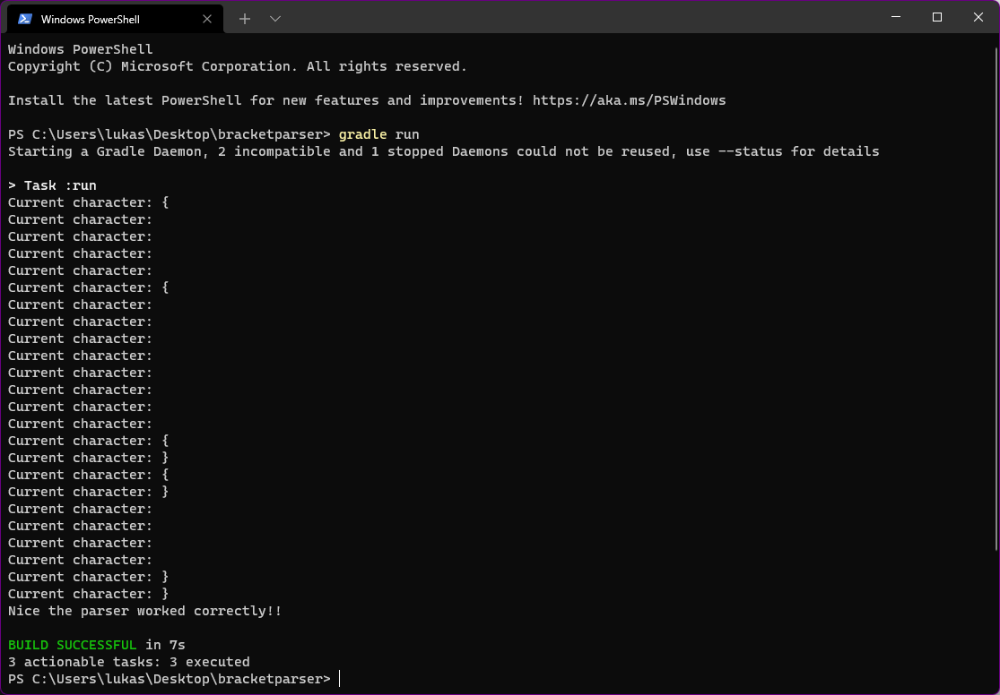

# Bracket Parser

## Task
In the resources folder you will find a text file. Your task is to parse this file and check if the 
every opening `{` has a closing `}`. For example look at
following valid file. You do not care about other elements besides `{}`.
~~~
{
    {
        {}{}
    }
}
~~~

If you are missing an opening bracket you should throw a `ParsingException` with the following message:

~~~
Error parsing the file. { expected
~~~

Do the same for a missing closing bracket, but with the following text:

~~~
Error parsing the file. } expected
~~~

You should not parse on and find more errors.

An invalid example could look like this:

~~~
{
    {
        {
            {
                {
                    {
                        {
                            {
                                {

                                }
                            }
                        }
                    }

            }
        }
   }
}
~~~

Of course you can make more sample files to test your implementation.

**Important:** Every parsed element must be added to the provided `elementStack`.

## Unit tests

In the test directory you can find unit tests. Therefore do not modify 
the mehtod signature of:

~~~java
public void parseFile(final String filename) throws ParsingException {...}
~~~

Of course you should use the tests and implement more methods accordingly
if needed.

A correct run of the tests will look like:

In your submission also provide the generated test summary made by gradle.
A screenshot is sufficient.

It can be found in:

~~~
path to your project/bracketparser/build/reports/tests/test/index.html
~~~

# Tips
You can print out the current element which you are parsing. You do not
need this for your submission.

A look inside the `java.nio` (new input output) can be useful.

If you have a stream and want to get a list from it you need to do
the following:

~~~java
List<E> list = someStream.toList();
~~~

---
Please install and use Java 17, since we will work with it in future 
assignments.

Open a power shell as admin and type:

~~~shell
choco install microsoft-openjdk17
~~~

Which downloads the OpenJDK built from Microsoft.

